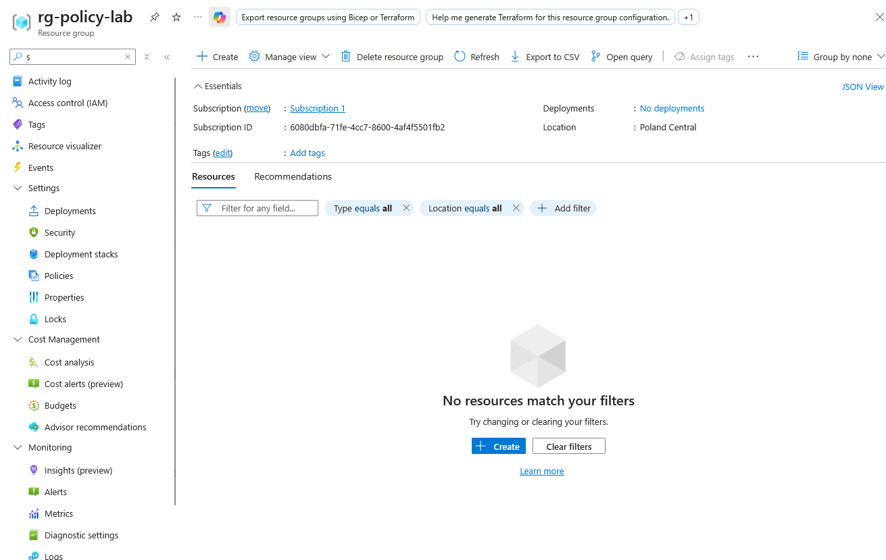
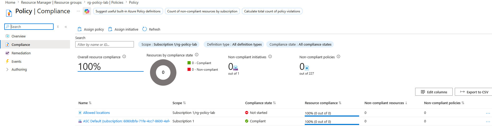
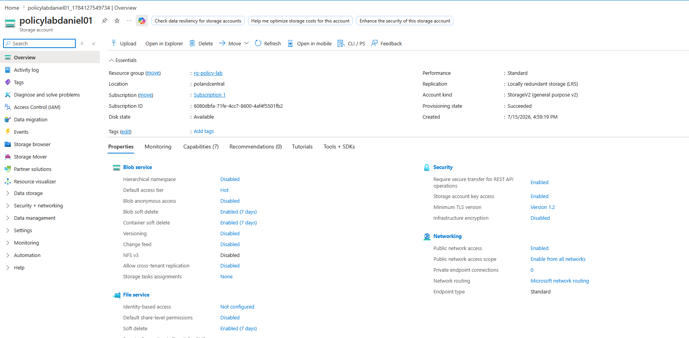
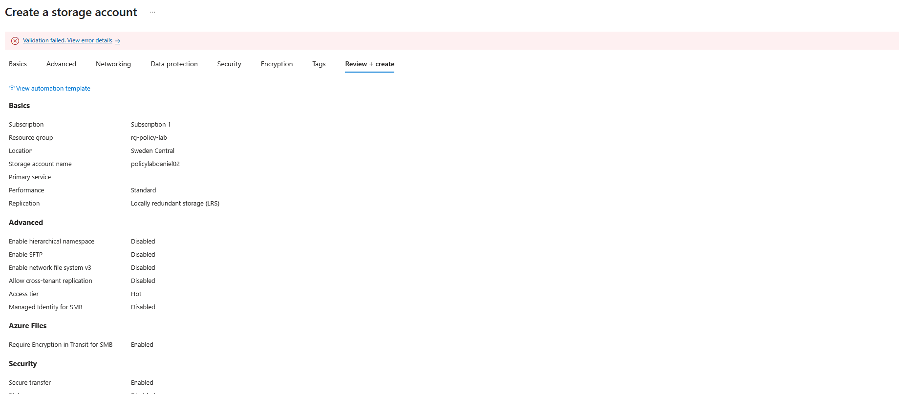
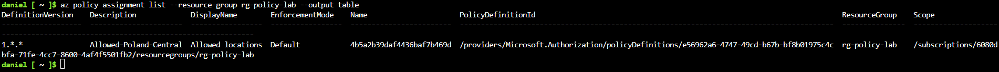
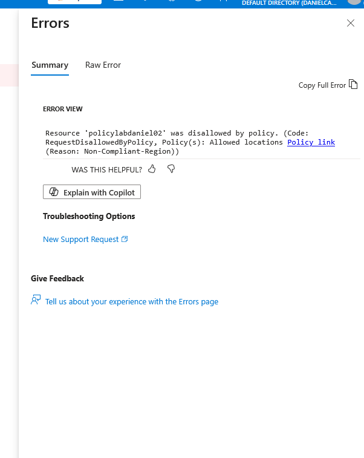

# Azure Policy Compliance Lab

## Overview
This lab demonstrates how Azure Policy can enforce organizational rules by restricting resource deployments to approved locations. The policy used in this lab was **Allowed locations**, assigned at the **resource group** scope `rg-policy-lab`.

## Lab Details
- **Policy used:** Allowed locations
- **Policy name:** Allowed Locations
- **Scope:** Resource group `rg-policy-lab`
- **Allowed region:** Poland Central
- **Enforcement:** Enabled
- **Resource type tested:** Storage account
- **Scope of test:** Resource level

## Objective
The goal of this lab was to verify that:
- resources deployed in the approved region are allowed
- resources deployed outside the approved region are denied by policy

## Test Results
### Allowed deployment
A storage account deployed in **Poland Central** was created successfully.

### Denied deployment
A storage account deployed in a **non-approved region** was blocked by Azure Policy.

## Evidence

### Resource group created

### Policy assignment

### Allowed deployment success

### Blocked deployment error

### CLI validation

### Policy under effect

## Key Takeaways
- Azure Policy can enforce governance rules before resources are created.
- Allowed locations helps prevent deployments in unauthorized regions.
- Policy enforcement works differently from RBAC:
  - **RBAC** controls who can perform actions
  - **Azure Policy** controls what can be deployed and where

## Conclusion
This lab showed that Azure Policy can successfully restrict deployments to approved locations and deny non-compliant resources at creation time.
