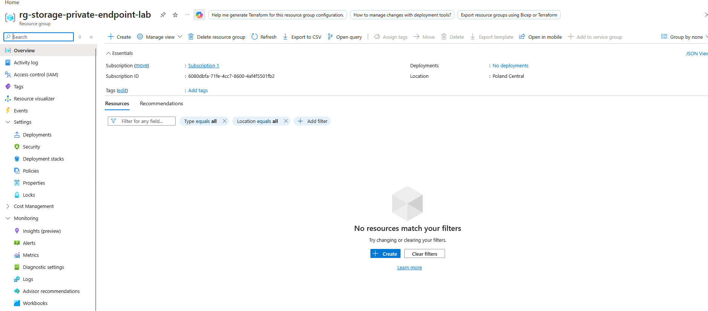
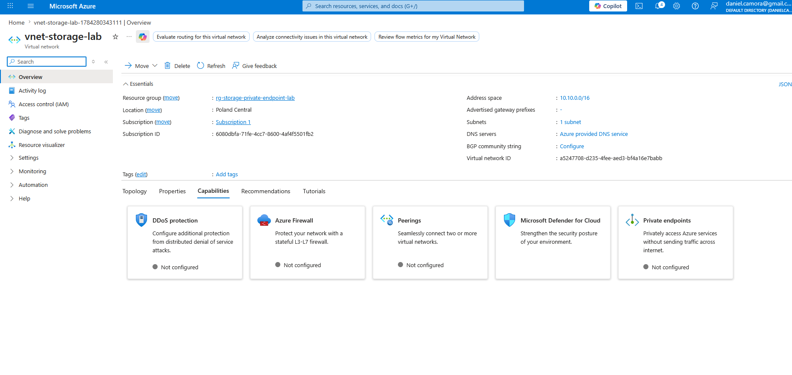
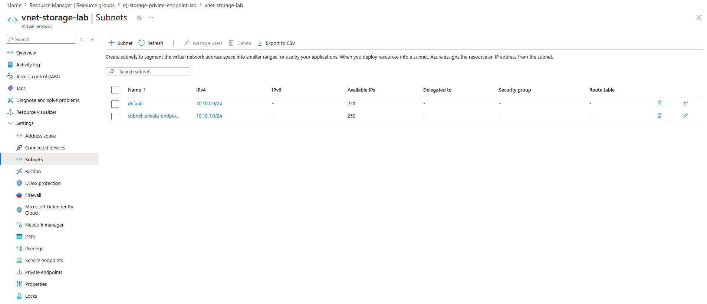
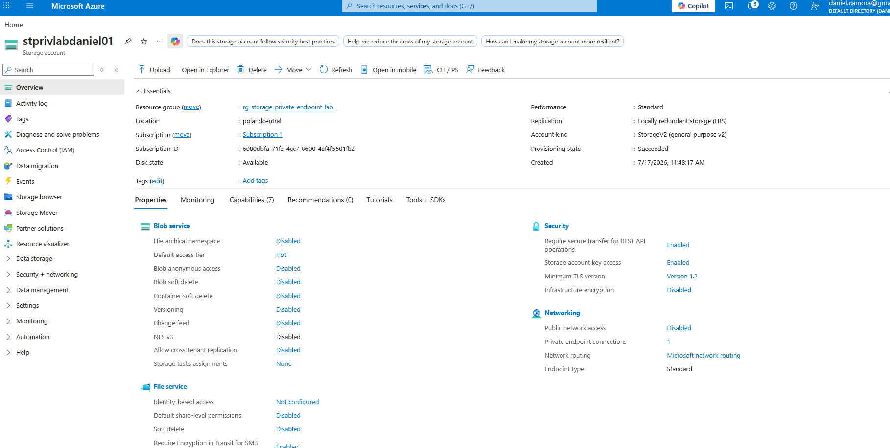
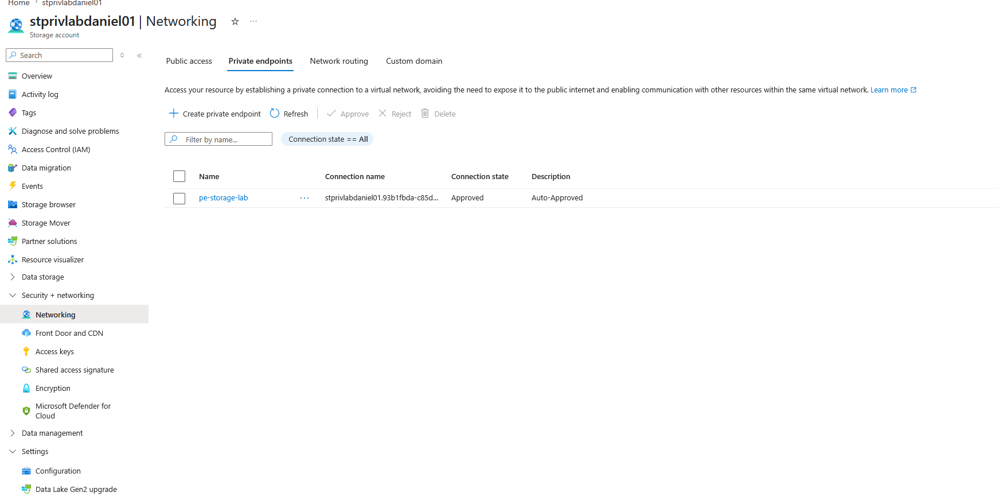
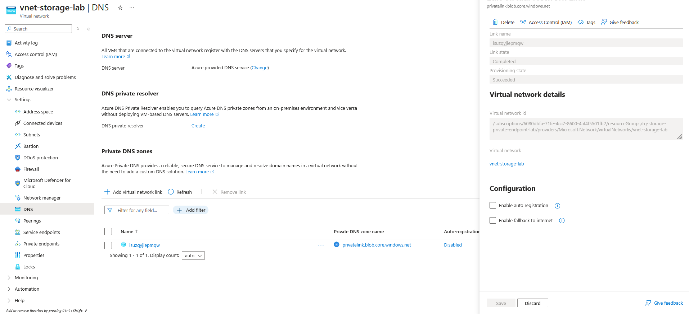
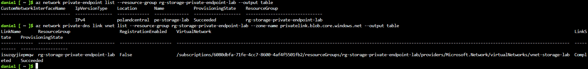
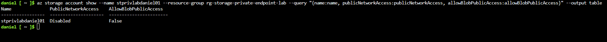

# Azure Storage Private Endpoint Lab

## Overview
This lab demonstrates how to secure an Azure Storage Account by disabling public network access and exposing it only through a Private Endpoint inside a virtual network. It also includes Private DNS integration and validation using Azure CLI and `nslookup`.

This project demonstrates a secure Azure storage design using Private Endpoint, Private DNS, and disabled public access.

## Lab Details
- **Resource Group:** `rg-storage-private-endpoint-lab`
- **Virtual Network:** `vnet-storage-lab`
- **Subnet:** `subnet-private-endpoint`
- **Private Endpoint:** `pe-storage-lab`
- **Storage Account:** `stprivlabdaniel01`
- **Region:** Poland Central
- **Private DNS Zone:** `privatelink.blob.core.windows.net`

## Objectives
- Create a secure Azure Storage deployment
- Disable public network access to the storage account
- Use a Private Endpoint for private connectivity
- Integrate Private DNS for name resolution
- Validate the configuration using Azure CLI and `nslookup`

## Architecture Summary
The lab uses a virtual network with a dedicated subnet for the private endpoint. The storage account is configured with public access disabled, and a Private Endpoint provides private access to the Blob service. A Private DNS zone is linked to the virtual network to support internal name resolution.

## Lab Steps

### 1. Create the Resource Group
A new resource group was created to contain all lab resources.

### 2. Create the Virtual Network
A virtual network named `vnet-storage-lab` was created to host the private endpoint.

### 3. Create the Subnet
A dedicated subnet named `subnet-private-endpoint` was created for the private endpoint.

### 4. Create the Storage Account
The storage account `stprivlabdaniel01` was created in the resource group.

### 5. Disable Public Access
Public network access was disabled for the storage account to prevent public exposure.

### 6. Create the Private Endpoint
A private endpoint named `pe-storage-lab` was created for the Blob service and placed in the private subnet.

### 7. Configure Private DNS
The private DNS zone `privatelink.blob.core.windows.net` was created and linked to the virtual network.

## Validation

### Azure CLI Validation
The storage account configuration was validated with Azure CLI:

- `PublicNetworkAccess = Disabled`
- `AllowBlobPublicAccess = False`

### Private Endpoint Validation
The private endpoint was successfully created and provisioned.

### Private DNS Validation
The Private DNS zone link was completed successfully.

### Local DNS Validation
`nslookup` was used from the local workstation to test name resolution for the storage account endpoint. The result returned the public Azure endpoint, which confirmed that the workstation was not inside the private network boundary.

## Evidence

### Resource Group

### Virtual Network

### Subnet

### Storage Account

### Private Endpoint Networking

### DNS Configuration

### Private Endpoint Validation

### Public Access Validation

### nslookup Validation

## Key Takeaways
- Azure Storage can be secured by removing public network access
- Private Endpoints provide private connectivity to PaaS services
- Private DNS is required for proper name resolution
- CLI validation helps prove the security posture of the deployment
- This is a strong low-cost Azure security lab for a portfolio

## Conclusion
This lab showed how to secure Azure Storage using a Private Endpoint, Private DNS, and disabled public access. The solution reduces exposure to the internet and demonstrates core Azure security concepts relevant to cloud and cybersecurity roles.
